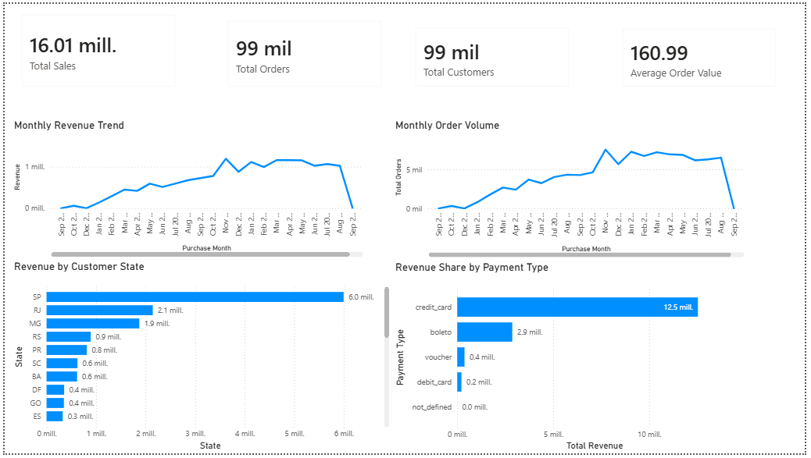
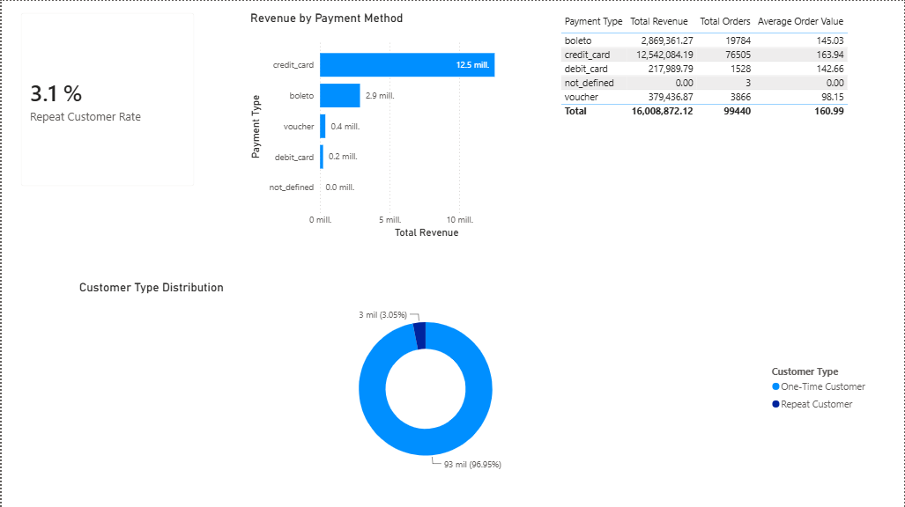
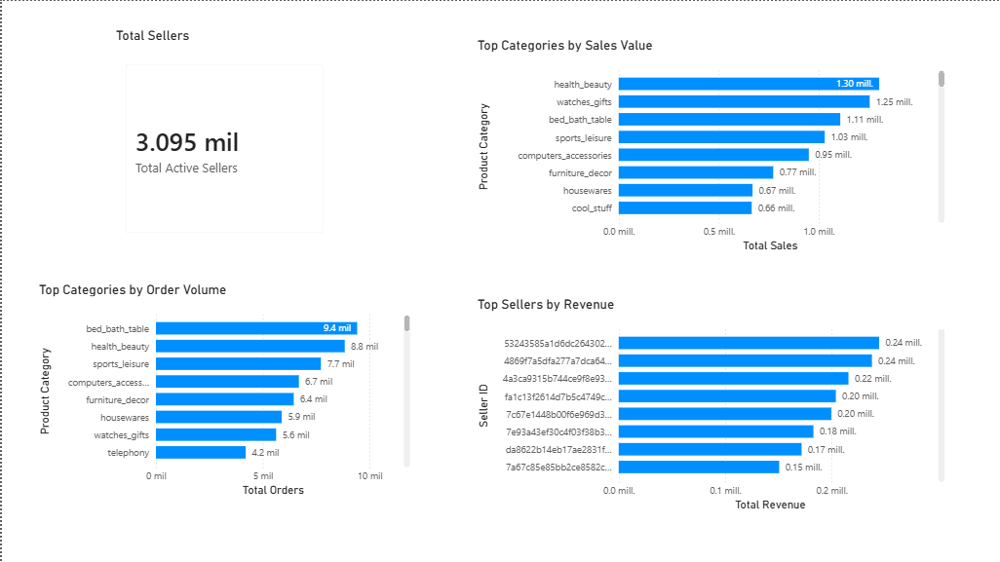
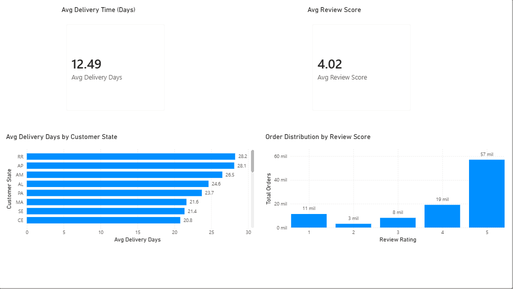

# Olist Brazilian E-Commerce Analysis

## Project Overview

This project presents an end-to-end analysis of the Brazilian e-commerce marketplace **Olist**, using PostgreSQL and SQL to transform raw transactional data into business insights.

The analysis follows a practical Data Analyst workflow:

**Data → Data Quality → SQL Analysis → KPIs → Business Insights → Recommendations → Power BI**

The objective is to understand sales performance, customer behavior, product and seller performance, and logistics and delivery outcomes.

---

## Business Context

Olist is a Brazilian e-commerce marketplace that connects merchants with customers across Brazil.

The dataset contains approximately 100,000 orders placed between 2016 and 2018 and includes information about:

* Customers
* Orders
* Order items
* Payments
* Reviews
* Products
* Sellers
* Geolocation
* Product categories

This project analyzes these datasets from a business perspective rather than focusing only on technical SQL operations.

---

## Key Business Areas

The analysis is organized into four major areas:

### 1. Executive Overview

High-level business performance, including:

* Total orders
* Sales and payment value
* Average order value
* Sales trends
* Order status
* Payment methods

### 2. Customer & Sales Analysis

Analysis of:

* Customer purchase frequency
* One-time vs. repeat customers
* Sales by customer state
* Customer behavior
* Average order value
* Monthly sales trends
* Sales growth

### 3. Product & Seller Analysis

Analysis of:

* Product category performance
* Top-selling categories
* Seller performance
* Seller customer reach
* Product price
* Freight cost
* Category-level commercial performance

### 4. Logistics & Delivery Performance

Analysis of:

* Delivery performance
* Estimated vs. actual delivery dates
* Freight costs
* Delivery delays
* Review scores
* Relationship between delivery performance and customer satisfaction
* Order cancellations and unavailability

---

## Data Quality Assessment

Before performing the business analysis, the dataset was evaluated for common data-quality issues.

The validation included:

* Row counts
* Duplicate primary keys
* Missing values
* Date ranges
* Negative payment values
* Invalid installment values
* Referential integrity
* Orphan records
* Payment method distribution
* Product and seller relationships

The data-quality assessment is documented in:

`sql/01_data_quality.sql`

---

## SQL Analysis

The business analysis was performed using PostgreSQL.

The SQL analysis includes practical techniques commonly used in professional Data Analyst workflows:

* `SELECT`
* `WHERE`
* `GROUP BY`
* `HAVING`
* `ORDER BY`
* `JOIN`
* `LEFT JOIN`
* Subqueries
* Common Table Expressions (CTEs)
* `CASE`
* `COALESCE`
* Aggregate functions
* Date functions
* Window functions
* Ranking
* Percentage calculations
* Year-over-year analysis
* Monthly trend analysis

The complete business-question analysis is available in:

`sql/02_business_questions.sql`

---

## Key Findings

The analysis identified several relevant patterns in the Olist marketplace data.

### Sales Growth

The marketplace experienced substantial growth between 2016 and 2018, with both order volume and payment value increasing significantly.

### Customer Behavior

The customer base is predominantly composed of customers with a single recorded purchase, while repeat customers represent a smaller segment with a different revenue contribution.

### Payment Methods

Credit card payments represent the largest payment category in the dataset.

### Geographic Distribution

Sales activity varies considerably across Brazilian states, reflecting differences in customer concentration and marketplace activity.

### Logistics & Customer Experience

Delivery performance is an important dimension of the customer experience. The analysis compares estimated and actual delivery dates and examines the relationship between delivery outcomes and review scores.

> Detailed metrics and supporting SQL queries are available in the project files.

---

## Business Recommendations

Based on the analytical findings, the project explores opportunities related to:

* Customer retention
* Repeat-purchase strategies
* Regional sales development
* Seller performance monitoring
* Product category optimization
* Freight-cost management
* Delivery performance
* Customer experience

The recommendations are derived from the analytical results rather than from assumptions about the business.

---

## Tools & Technologies

| Tool       | Purpose                                     |
| ---------- | ------------------------------------------- |
| PostgreSQL | Database and SQL analysis                   |
| DBeaver    | SQL development and database management     |
| Power BI   | Data visualization and dashboarding         |
| Excel      | Supporting analysis and validation          |
| GitHub     | Version control and portfolio documentation |

---

## Project Structure

```text
olist-brazilian-ecommerce-analysis/
│
├── README.md
│
├── sql/
│   ├── 01_data_quality.sql
│   └── 02_business_questions.sql
│
└── powerbi/
    └── README.md
```

Raw datasets and local processing files are intentionally excluded from the repository.

---
## Dashboard Preview

### Executive Overview



### Customer & Sales Analysis



### Product & Seller Analysis



### Logistics & Delivery Performance



---

## Analytical Workflow

```text
Raw Data
   ↓
Data Quality Assessment
   ↓
Database Validation
   ↓
Business Questions
   ↓
SQL Analysis
   ↓
KPI Calculation
   ↓
Trend & Segment Analysis
   ↓
Business Insights
   ↓
Recommendations
   ↓
Power BI Visualization
```

---

## Portfolio Objective

This project demonstrates the ability to work through a complete analytical process, from understanding and validating a relational dataset to producing business-oriented analysis and recommendations.

The focus is on practical skills that can be applied to real-world Data Analyst projects:

**SQL + Data Quality + Business Analysis + KPIs + Visualization + Communication**

---

## Author

**Alberto Sanchez**

Systems Engineer | Data Analyst

**Core Skills:** SQL · PostgreSQL · Power BI · Excel · Data Analysis · Data Quality

GitHub: [albertosanchez-data](https://github.com/albertosanchez-data)
